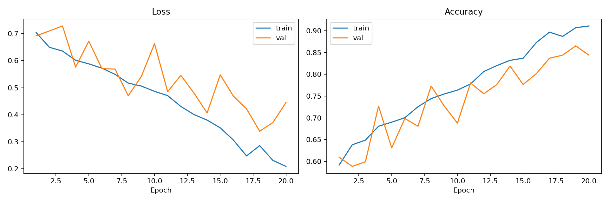
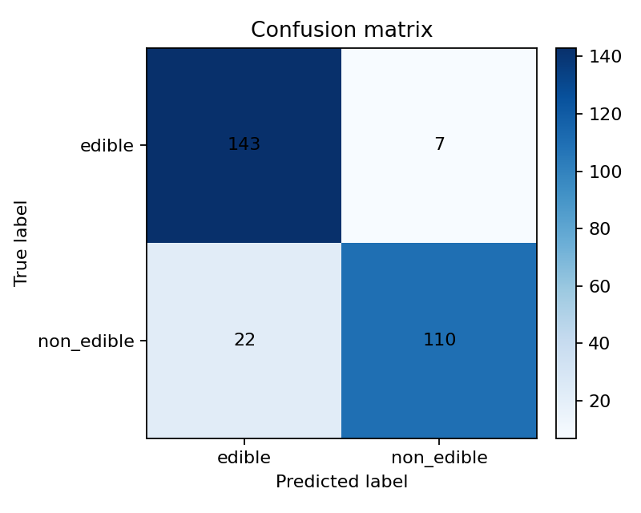

# Mushroom Edibility Classifier

ML-проект для бинарной классификации изображений грибов на два класса:

- `edible` — съедобный гриб;
- `non_edible` — несъедобный или потенциально опасный гриб.

Проект является учебным и демонстрационным. Модель не должна использоваться для принятия реальных решений о безопасности употребления грибов в пищу.

## Бизнес-задача

Пользователю может быть сложно визуально отличить съедобные грибы от опасных. Цель проекта — построить прототип системы компьютерного зрения, которая по изображению гриба возвращает предварительную классификацию и уверенность модели.

Практический сценарий — образовательное приложение или справочник грибника, где модель помогает показать вероятный класс изображения. Критически важная ошибка: несъедобный гриб классифицирован как съедобный. Поэтому среди метрик отдельно отслеживается recall для класса `non_edible`.

## Данные

Используется датасет Kaggle [Edible & Poisonous Mushroom Classification](https://www.kaggle.com/datasets/benedictusjason/edible-and-poisonous-mushroom-classification).

Исходные изображения размещаются локально в папке:

```text
data/raw/splitted_dataset/
├── train/
│   ├── edible/
│   └── poisonous/
├── val/
│   ├── edible/
│   └── poisonous/
└── test/
    ├── edible/
    └── poisonous/
```

В проектной постановке исходный класс `poisonous` нормализуется в целевой класс `non_edible`.

Данные не хранятся в git-репозитории. Папки `data/raw/` и `data/processed/` добавлены в `.gitignore`.

## Архитектура ML-пайплайна

```text
Загрузка изображений
        ↓
EDA и проверка качества данных
        ↓
Preprocessing изображений
        ↓
Обучение baseline CNN
        ↓
Оценка качества на validation/test
        ↓
Сохранение модели и отчётов
        ↓
Подготовка README, тестов, Docker, CI/CD и мониторинга
```

## ETL и preprocessing

Подготовка датасета реализована в [src/data/prepare_dataset.py](src/data/prepare_dataset.py).

Скрипт выполняет:

- Extract: читает изображения из `data/raw/splitted_dataset`;
- Transform: проверяет читаемость файлов, переводит изображения в RGB, приводит их к размеру `224x224`, сохраняет пропорции через padding;
- Load: сохраняет обработанные изображения в `data/processed`, создаёт CSV-манифесты и `dataset_metadata.json`.

Команда для сухой проверки без записи файлов:

```powershell
.\.venv\Scripts\python.exe src\data\prepare_dataset.py --dry-run
```

Команда для создания обработанного датасета:

```powershell
.\.venv\Scripts\python.exe src\data\prepare_dataset.py --overwrite
```

После preprocessing структура данных:

```text
data/processed/
├── train/
│   ├── edible/
│   └── non_edible/
├── val/
│   ├── edible/
│   └── non_edible/
├── test/
│   ├── edible/
│   └── non_edible/
├── manifest.csv
├── train_manifest.csv
├── val_manifest.csv
├── test_manifest.csv
└── dataset_metadata.json
```

## EDA

Основной ноутбук EDA: [notebooks/eda.ipynb](notebooks/eda.ipynb).

EDA покрывает:

- размер датасета и распределение по `train`, `val`, `test`;
- баланс классов `edible` и `non_edible`;
- видовое разнообразие по именам файлов;
- форматы изображений и цветовые режимы;
- размеры изображений и соотношение сторон;
- проверку битых файлов;
- поиск точных дубликатов по SHA-256;
- визуальную проверку примеров.

Результаты проверки качества данных:

| Показатель | Значение |
| --- | ---: |
| Всего валидных изображений | 2820 |
| Битых изображений | 0 |
| `edible` | 1500 |
| `non_edible` | 1320 |
| Групп точных дубликатов | 1296 |
| Групп дубликатов между разными split | 466 |

Дубликаты между `train`, `val` и `test` являются ограничением текущего датасета: они могут завышать метрики модели. В текущей итерации split оставлен как в исходных данных, но это ограничение учитывается в выводах.

Отчёты по дубликатам:

- [reports/data_quality/duplicates_summary.csv](reports/data_quality/duplicates_summary.csv)
- [reports/data_quality/duplicates_long.csv](reports/data_quality/duplicates_long.csv)

## Baseline-модель

Обучение baseline реализовано в [src/training/train_baseline.py](src/training/train_baseline.py).

Используется кастомный training pipeline на PyTorch:

- архитектура: `ResNet18`;
- вход: RGB-изображение `224x224`;
- loss: `CrossEntropyLoss` с весами классов;
- optimizer: `AdamW`;
- scheduler: `ReduceLROnPlateau`;
- early stopping по validation F1;
- аугментации train-выборки: horizontal flip, rotation, color jitter;
- метрика выбора лучшей модели: F1 для класса `non_edible`.

Команда запуска:

```powershell
.\.venv\Scripts\python.exe src\training\train_baseline.py
```

Для эксперимента с ImageNet-весами:

```powershell
.\.venv\Scripts\python.exe src\training\train_baseline.py --pretrained --epochs 20 --learning-rate 0.0001
```

## Результаты baseline

Лучший текущий запуск зафиксирован в [reports/baseline/BEST_BASELINE.md](reports/baseline/BEST_BASELINE.md) и [reports/baseline/best_baseline.json](reports/baseline/best_baseline.json).

Параметры лучшего запуска:

| Параметр | Значение |
| --- | --- |
| Архитектура | `resnet18` |
| Pretrained weights | `false` |
| Epochs | 20 |
| Best epoch | 19 |
| Batch size | 32 |
| Learning rate | 0.0003 |
| Device | CUDA |

Validation:

| Метрика | Значение |
| --- | ---: |
| Accuracy | 0.8652 |
| Precision `non_edible` | 0.8615 |
| Recall `non_edible` | 0.8485 |
| F1 `non_edible` | 0.8550 |
| ROC-AUC | 0.9296 |

Test:

| Метрика | Значение |
| --- | ---: |
| Accuracy | 0.8972 |
| Precision `non_edible` | 0.9402 |
| Recall `non_edible` | 0.8333 |
| F1 `non_edible` | 0.8835 |
| ROC-AUC | 0.9355 |

Classification report:

```text
              precision    recall  f1-score   support

      edible       0.87      0.95      0.91       150
  non_edible       0.94      0.83      0.88       132

    accuracy                           0.90       282
   macro avg       0.90      0.89      0.90       282
weighted avg       0.90      0.90      0.90       282
```

Графики и артефакты:

- [reports/baseline/training_curves.png](reports/baseline/training_curves.png)
- [reports/baseline/confusion_matrix.png](reports/baseline/confusion_matrix.png)
- [reports/baseline/metrics.json](reports/baseline/metrics.json)
- [reports/baseline/history.csv](reports/baseline/history.csv)
- `models/baseline_resnet18.pt`





## Установка и запуск

Создание окружения:

```powershell
python -m venv .venv
.\.venv\Scripts\activate
python -m pip install --upgrade pip
python -m pip install -r requirements.txt
```

Подготовка данных:

```powershell
.\.venv\Scripts\python.exe src\data\prepare_dataset.py --overwrite
```

Обучение baseline:

```powershell
.\.venv\Scripts\python.exe src\training\train_baseline.py
```

Запуск FastAPI-сервиса локально:

```powershell
.\.venv\Scripts\uvicorn.exe src.api.app:app --host 0.0.0.0 --port 8000
```

Основные endpoint'ы сервиса:

- `POST /predict` — принимает изображение и возвращает предсказанный класс, confidence и вероятности по классам;
- `GET /monitoring` — возвращает состояние сервиса, состояние модели, счётчики запросов, среднюю latency и инфраструктурные метрики;
- `GET /ui` — простая web-страница для загрузки изображения, просмотра prediction-результата и текущего мониторинга.

После запуска локальный UI доступен по адресу: <http://localhost:8000/ui>.

Пример prediction-запроса:

```powershell
curl.exe -X POST "http://localhost:8000/predict" `
  -F "file=@data/processed/test/edible/edible_000000.jpg"
```

Пример monitoring-запроса:

```powershell
curl.exe "http://localhost:8000/monitoring"
```

## Тестирование

Тесты написаны на `pytest` и лежат в папке [tests](tests).

Покрыты:

- извлечение вида гриба из имени файла;
- чтение метаданных изображения;
- preprocessing изображения в RGB JPEG нужного размера;
- создание структуры `data/processed`;
- генерация метаданных датасета и подсчёт дубликатов;
- smoke-проверка трансформаций и baseline-модели;
- smoke-проверка FastAPI endpoint'ов `/`, `/ui` и `/monitoring`.

Файл [tests/conftest.py](tests/conftest.py) добавляет корень проекта в `sys.path`, чтобы импорты вида `from src...` корректно работали при запуске тестов из IDE и из терминала.

Команда запуска из корня проекта:

```powershell
.\.venv\Scripts\python.exe -m pytest tests -q
```

## Docker

Контейнеризация реализована через [Dockerfile](Dockerfile) и [docker-compose.yml](docker-compose.yml). Основной способ запуска сервиса — Docker Compose. В образ копируются только код, тесты, README и зависимости. Локальные данные, модели, отчёты, `.venv` и служебные файлы исключены через [.dockerignore](.dockerignore).

Сборка образа:

```powershell
docker build -t mushroom-classifier .
```

Запуск API-сервиса:

```powershell
docker compose up --build api
```

После запуска:

- Web UI: <http://localhost:8000/ui>
- Swagger UI: <http://localhost:8000/docs>
- prediction endpoint: <http://localhost:8000/predict>
- monitoring endpoint: <http://localhost:8000/monitoring>

Запуск тестов через compose:

```powershell
docker compose --profile tools run --rm tests
```

Запуск preprocessing через compose:

```powershell
docker compose --profile tools run --rm preprocess
```

Запуск обучения baseline через compose:

```powershell
docker compose --profile tools run --rm train
```

## CI/CD

Непрерывная интеграция настроена через GitHub Actions: [.github/workflows/ci.yml](.github/workflows/ci.yml).

Workflow запускается при:

- `push` в ветки `main` и `master`;
- `pull_request` в ветки `main` и `master`;
- ручном запуске через `workflow_dispatch`.

CI выполняет:

- checkout репозитория;
- установку Python `3.11`;
- установку зависимостей из `requirements.txt`;
- синтаксическую проверку ключевых Python-файлов через `py_compile`;
- запуск тестов:

```bash
python -m pytest tests -q
```

Основные git-команды для доставки изменений:

```bash
git status
git add .
git commit -m "Add baseline pipeline tests and CI"
git push origin main
```

## Структура проекта

```text
.
├── .github/
│   └── workflows/
│       └── ci.yml
├── data/
│   ├── raw/                 # локальные исходные данные, не хранится в git
│   └── processed/           # обработанные данные, не хранится в git
├── models/                  # сохранённые модели, не хранится в git
├── notebooks/
│   └── eda.ipynb
├── reports/
│   ├── baseline/
│   └── data_quality/
├── src/
│   ├── api/
│   │   ├── __init__.py
│   │   └── app.py
│   ├── data/
│   │   ├── __init__.py
│   │   └── prepare_dataset.py
│   └── training/
│       ├── __init__.py
│       └── train_baseline.py
├── tests/
│   ├── conftest.py
│   ├── test_api.py
│   ├── test_prepare_dataset.py
│   └── test_train_baseline.py
├── .dockerignore
├── .gitignore
├── Dockerfile
├── docker-compose.yml
├── requirements.txt
└── README.md
```

## Метрики качества

Для оценки используются:

- accuracy;
- precision;
- recall;
- F1-score;
- ROC-AUC;
- confusion matrix.

Основная бизнес-метрика безопасности — recall для `non_edible`. Чем выше recall, тем меньше несъедобных грибов модель ошибочно относит к съедобным.

## Мониторинг

В текущей версии мониторинг реализован через сохраняемые артефакты обучения:

- `history.csv` — динамика loss и accuracy по эпохам;
- `training_curves.png` — визуализация обучения;
- `classification_report.txt` — качество по классам;
- `confusion_matrix.png` — структура ошибок;
- `metrics.json` — итоговые метрики запуска.

В FastAPI-сервисе дополнительно доступен endpoint `GET /monitoring`, который возвращает:

- статус сервиса и uptime;
- информацию о загруженной модели;
- количество prediction-запросов и ошибок;
- среднюю latency успешных предсказаний;
- загрузку CPU, память процесса, доступность CUDA.

Для ручной проверки предсказаний добавлена web-страница `GET /ui`: на ней можно выбрать изображение, отправить его в `/predict`, увидеть confidence и вероятности классов, а также смотреть live-сводку `/monitoring`.

Для дальнейшего развития можно добавить мониторинг распределения входных изображений: размеры, форматы, доли классов, долю невалидных изображений и изменение метрик на новых данных.

## Текущий статус

Сделано:

- EDA датасета;
- preprocessing изображений;
- подготовка манифестов;
- обучение baseline CNN;
- сохранение модели, метрик и графиков;
- фиксация лучшего baseline;
- FastAPI-сервис с endpoint'ами `/predict`, `/monitoring` и `/ui`;
- web UI для ручной проверки предсказаний и мониторинга;
- pytest-тесты для preprocessing и training pipeline;
- Dockerfile, `.dockerignore` и `docker-compose.yml` для контейнеризации пайплайна и сервиса;
- GitHub Actions workflow для CI;
- `.gitignore` для данных, окружения, моделей и служебных файлов.

Следующие шаги:

- подготовить презентацию на 5-7 слайдов.
